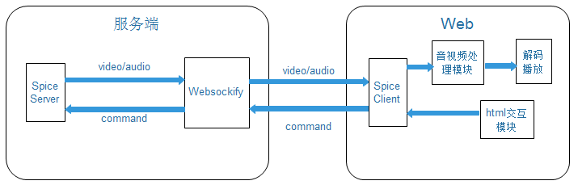
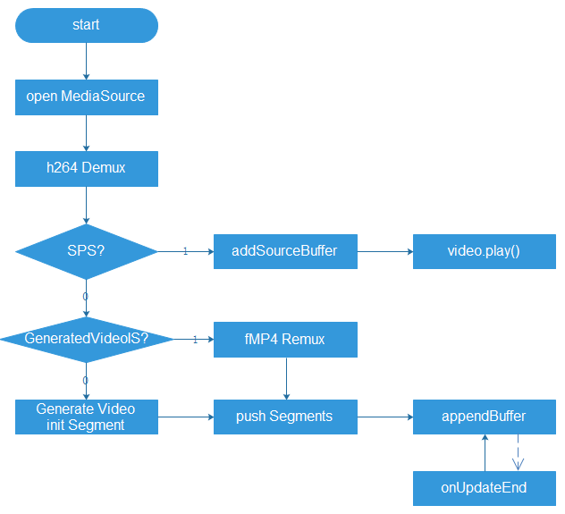
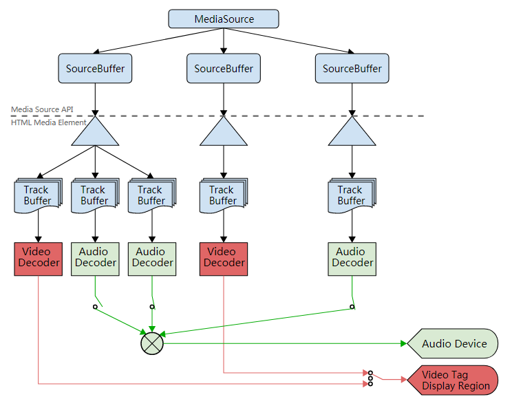
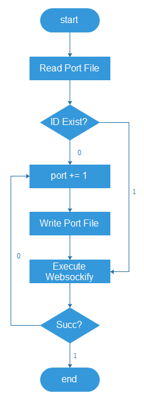

## 需求概述

+ 用户可从chromebook，PC端的chrome浏览器登录虚拟机
+ 可以控制虚拟机的开机，关机，重启，断电，登录等操作
+ 可从web端登录虚拟机，提供不低于终端的操作体验（音视频播放流畅，同步，交互延时低等）
+ 支持快捷键操作
+ 性能需求：Chromebook，PC等常见的移动终端设备能较轻松流畅的操作虚拟机，播放音视频等。

## 条件与限制

+ 不支持USB重定向
+ 不支持视频重定向
+ 不支持广播
+ 不支持双屏
+ 目前只支持windows平台和chromebook平台的chrome浏览器
+ 不支持VDX协议

## 系统详细设计

### 系统结构设计及子系统划分

系统结构图

网页版VDI客户端主要分成四个模块：

1. 视频流处理模块
2. 音频流处理模块
2. Web html交互模块
3. Spice服务端支持模块（opus，websockify）

### 视频流处理模块详细设计

#### 视频流处理总体设计

视频处理流程图

视频处理流程说明:

+ Open MediaSource:	创建MediaSource关联到video标签媒体源，参考图3-2
+ H264 Demux:	对收到h264视频帧数据解析，获取视频相关信息用于解码
+ SPS?	:判断是否为SPS数据，用于浏览器初始化解码器
+ addSourceBuffer:	创建并添加SourceBuffer到video标签，参考图3-2
+ Video.play():	播放视频
+ GeneratedVideoIS？ :	判断是否已生成过“初始视频帧”
+ fMP4 Remux	:将h264视频帧封装成fMP4帧格式
+ Generate Video initSegment	:根据获取到的视频信息创建“初始视频帧”，“初始视频帧”用于初始化解码器
+ Push Segments:	将已封装好的分片保存到segments数组
+ appendBuffer:	将分片填充到SourceBuffer里面
+ onUpdateEnd:	appendBuffer填充数据成功后，会产生updateend事件，onUpdateEnd是处理该事件回调函数，再次appendBuffer。

 
MSE原理图

#### 视频流处理编码设计

1. MSE初始化  
调用MediaSource()接口创建MediaSource对象，调用CreateObjectUrl创建Blob对象，关联	到video标签的媒体源地址。收到SPS后，调用addSourceBuffer接口创建MediaSource的	SourceBuffer，用于之后的视频数据提交。调用play()接口播放视频。
2. H264解析  
H264编码后的数据以 00 00 01或者00 00 00 01划分数据单元，从收到的h264数据流中解析
出数据单元，根据数据单元的类型做不同处理，数据单元有以下类型：
NDR（1），IDR（5），SEI（6），SPS（7），PPS（8），AUD（9），End of Sequence（10）， 	End of Stream（11） 等，之后生成解码时间，播放时间。
3. 生成“初始视频帧”  
根据收到SPS，PPS以及其他数据调用MP4的initSegment生成初始视频帧，initSegment里
包含FTYP，moov等mp4 box。之后调用MSE的AppendBuffer接口将初始视频帧填充到	SourceBuffer，video标签获取初始视频帧后初始化fMP4解码器。
4. 普通视频帧封装  
普通视频帧根据h264中解析出来的数据单元，构造mdat和moof box，将生成的fMP4 segment	保存到segments数组。
5. 数据填充与回调处理  
调用MSE接口appendBuffer执行数据填充算法。在前一个appendBuffer异步接口处理完成后	会生成updateend事件，在该事件处理函数onSBUpdateEnd中从segments数组获取segment继	续执行appendBuffer操作。

#### 关键问题解决方案

1. 倒转  
	+ 原因：spice 服务端编码的h264图像数据是倒的
	+ 解决方案：利用CSS3的旋转功能，绕着X轴旋转180度
2. 延时
	+ 原因：chrome浏览器的解码器默认不是以直播流的模式解码视频帧，所以会在解码的时候缓存4帧数据。
	+ 解决方案：在fMP4封装中设置mvhd.duration = 0，如果有mehd的话，设置mehd.fragmentDuration = 0，这样chrome 会进入“low delay mode”， 不会缓存数据 
3. 花屏
	+ 原因： websocket代理流式传输导致了帧的切割与合并
	+ 解决方案： 在浏览器收到h264数据后自己解析帧的边界，把完整的一帧提交给h264解	  析器，封装fMP4packet，喂给MediaSourceBuffer。
4. 硬解码缓存，浏览器渲染缓存
	+ 原因：这是硬解码本身的设计缺陷以及chrom浏览器62版本以后的bug
	+ 解决方案：第一帧发送两帧冗余帧，并且超时30ms无数据多发一帧，原先发送数据类型为	  10,11的数据帧来flush解码器缓冲区的做法会导致video 的played timeranges的随机初    	  始化，进而导致桌面卡住一段时间。 
5. 浏览器视频无限缓存
	+ 原因：浏览器video标签的默认行为
	+ 解决方案：通过mediaSource的API可以得到当前已缓存的timerange视频数据，和当前已	  播放的timerange ，每当played.end()-buffer.start()>10 (s)时， 调用remove清空前	  10s缓冲视频数据。注意remove的调用不能和append调用同时进行，否则会有一个调用失	  败。
6. 标签页切换跳帧
	+ 原因：当切换到其他标签页时，video 后台不会解码图像，导致帧在缓冲区中累积，切回	  时引起帧播放延迟。
	+ 解决方案1：标签页切回时重新加载，缺点是加载时间较长。
	+ 解决方案2：切换到其他标签页时，丢弃所有收到的数据帧，切回时改变分辨率（一个像	  素）强制服务器发送带sps pps的关键帧，从最新位置开始播放。
	+ 解决方案3：自定义一条display通道消息类型，获取IDR帧（实际使用）。
7. 播放视频时修改分辨率卡死
	+ 原因：全屏时分辨率改变，在改变分辨率之间仍会收到很多数据，并且重新初始化需要较	  长时间导致帧卡死。
	+ 解决方案：在处理全屏时丢弃改变分辨率之前的数据，重新播放改变分辨率之后的数据。
8. 刷新视频帧卡住一段时间不播放
  	+ 原因：因为发送类型为10,11的空数据帧导致
	+ 解决方案：去掉这些数据帧，改为用冗余帧填充chromebook硬解码的一帧缓存

### 音频流处理模块详细设计

#### 音频流处理总体设计

音频处理流程图

音频处理流程说明:

+ Audio Init:	音频处理初始化，包括Opus解码器，PCM 数据缓冲区等
+ Recdive Opus Data:	从接收的数据包中解析出Opus编码数据
+ Opus Decode:	解码Opus数据，得到PCM数据
+ Write PCM	:将PCM数据写到PCM 缓冲区
+ CreateScriptProcessor:	创建 音频数据处理节点
+ Connect Destination:	连接到音频播放节点
+ Onaudioprocess:	音频数据处理回调，处理更多的音频数据
+ Read PCM:	从PCM缓冲区中读取PCM数据
+ CopyToChannel:	将PCM数据填充对象的左右声道

#### 音频流处理编码设计

1. 音频解码初始化  
	+ Spice client音频通道处理初始化，Opus设置音频采样率，通道数，音频脚本处理节点缓冲区大小，构造PCM数据缓冲区等。
2. Web Audio API  
	+ 调用CreateScriptProcessor创建音频处理节点。调用connect接口将该scriptNode的输出链接到audioContext.destination，及音频播放设备。该处理节点会在onaudioprocess回调函数中从PCM缓冲区中读取PCM数据，填充到对应的左右声道。
3. 解决卡顿、噪音  
	+ 原因：一是浏览器默认音频采样时48000，如果提供44100采样率的PCM数据会出现严重的卡顿和噪音。二是当wifi环境不好，网络欠佳的情况下，由于音频数据不及时，导致填充声道的数据是不确定的随机值，所以导致了噪音。
	+ 解决方案：一是直接将Opus解码后的48000采样率的音频输出到浏览器，不做重采样操作。二是判断当前PCM缓冲区中是否有足够数据，如果没有，用静音代替。
4. 音视频同步
	+ 原因：当网络环境不好时，由于出现音视频数据堵塞，但是视频数据以30fps速率播放，在视频帧不是非常饱和的情况下，视频帧会快速的播放完，但是音频首先是以固定时间为一帧来编码，其次以静音代替未到来的数据，后续堵塞住的数据会一直延后播放，导致音视频不同步。
	+ 解决方案：定期检测PCM缓冲区的数据是否超过一定时间（该缓冲区中的数据时间即代表延时时间），若超过1秒，则丢弃。

### html交互模块详细设计

#### Canvas和Video重叠设计

在video显示层上面覆盖一层透明的canvas画布，用于捕获鼠标点击事件。需要注意的	是video标签与canvas的完全重叠，以及分辨率修改后，保证video与canvas仍然完美重叠。

#### 鼠标键盘事件处理

将键盘事件注册到HMTL document，封装按键的keycode等信息成spice协议格式发送给	spice服务端，spice通过VDAgent传递到虚拟机里面执行相应的操作。FlexVDI提供了多套	KeyMap信息，对应英式，美式等各种键盘，一般选择美式键盘keymap即可。
另外，由于有一些组合快捷键会被浏览器所在的外部操作系统拦截或者chromebook自带	键盘上没有该按键，需要在虚拟机页面	的浮动条上提供常见的快捷键操作，如ALT+F4， 	Ctrl+Alt+Del， Win+L等。

### 服务端支持模块

#### Websockify 代理脚本实现

             
websocket代理启动脚本流程图

websocket 代理启动流程说明:

+ Read Port File： 读取虚拟机端口文件和web端口文件，获取代理端口信息
+ ID Exist?：	判断当前虚拟机ID是否存在端口文件中
+ Port += 1：	当虚拟机ID不在web端口文件或者当前端口已被占用时，尝试新端口
+ Write Port File：	将当前尝试的端口更新到web端口文件
+ Execute Websockify：	使用这两个端口，执行websockify代理
+ Succ?	： 判断代理是否执行成功，成功会一直执行，失败继续尝试新端口

#### Spice服务端修改

1. 添加Opus音频编码模块
2. 将数据发送到websocket代理服务器
3. 30ms如果没有视频帧数据，则多发前一帧的冗余帧
4. 第一帧多发两帧冗余帧